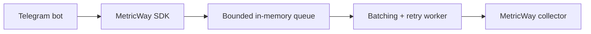

# MetricWay Python SDK

[](https://github.com/urlifeceo/metricway-sdk/actions/workflows/ci.yml)
[](https://pypi.org/project/metricway-sdk/)
[](https://pypi.org/project/metricway-sdk/)
[](LICENSE)

Асинхронный Python SDK для отправки продуктовых событий Telegram-бота в [MetricWay](https://metricway.tech). Поддерживает ручную отправку и автоматический сбор из aiogram 3, не блокируя обработчики сетевыми запросами.

## Установка и быстрый старт

Нужен Python 3.10+. Создайте проект в metricway и сохраните токен в переменной окружения `METRICWAY_PROJECT_TOKEN`. Для aiogram-бота установите пакет:

```bash
python -m pip install "metricway-sdk[aiogram]"
```

```python
import asyncio
import os

from aiogram import Bot, Dispatcher
from aiogram.filters import CommandStart
from aiogram.types import Message
from metricway import MetricsClient, setup_aiogram_metrics

metrics = MetricsClient(
    api_url="https://metricway.tech",
    project_token=os.environ["METRICWAY_PROJECT_TOKEN"],
)
dp = Dispatcher()
setup_aiogram_metrics(dp, metrics)


@dp.message(CommandStart())
async def start_command(message: Message) -> None:
    await message.answer("Привет!")


async def on_startup(bot: Bot) -> None:
    await metrics.start()


async def on_shutdown(bot: Bot) -> None:
    await metrics.close()


dp.startup.register(on_startup)
dp.shutdown.register(on_shutdown)


async def main() -> None:
    bot = Bot(token=os.environ["TELEGRAM_BOT_TOKEN"])
    try:
        await dp.start_polling(bot)
    finally:
        await bot.session.close()


if __name__ == "__main__":
    asyncio.run(main())
```

`setup_aiogram_metrics` подключают один раз к роутеру. Он учитывает все входящие сообщения и callback-запросы, даже без подходящего обработчика. В таком случае имя обработчика — `unknown`. Для ручной отправки без aiogram установите `metricway-sdk` без дополнения.


## Как устроено



Клиент разделяет сбор событий и сетевую доставку: публичные методы `track_*` только валидируют данные и кладут запись в ограниченную очередь, а отдельная asyncio-задача формирует батчи и отправляет их в collector.

Ключевые решения:

- **неблокирующая запись событий** — обработчик бота не ждёт HTTP-запрос;
- **ограниченная очередь** — контролирует потребление памяти и задаёт понятное поведение при перегрузке;
- **батчинг** — до 500 записей и не более 1 МиБ JSON на запрос;
- **retry policy** — повторяются сетевые ошибки, HTTP 429 и 5xx, учитывается `Retry-After`;
- **graceful shutdown** — `close()` пытается доставить накопленные события в пределах заданного timeout;
- **опциональная интеграция aiogram** — базовый пакет не требует aiogram.

## Ручная отправка

Методы `track_*` синхронные: они добавляют запись в очередь, не ожидая сеть.

```python
metrics.track_event(
    user_id=123,
    chat_id=456,
    handler="trial_started",
    update_type="trial",
    payload={"product_id": "pro_month"},
)
metrics.track_traffic(user_id=123, start_payload="campaign_a", utm_source="telegram")
metrics.track_error(
    user_id=123,
    error_type="PaymentError",
    error_message="Payment failed",
    stack="",
)
metrics.track_purchase(
    user_id=123,
    amount=990.0,
    currency="RUB",
    product_id="pro_month",
    payment_provider="telegram_payments",
)
```

Покупку отправляйте только после подтверждённой оплаты. Конвертации валюты нет.

## Автоматически собираемые данные

| Событие | Передаваемые данные |
| --- | --- |
| Сообщение | ID пользователя и чата, имя обработчика, тип обновления, полный текст |
| Callback | ID пользователя и чата, имя обработчика, тип обновления, callback data |
| `/start <payload>` | Дополнительная запись трафика со start payload |
| Ошибка обработчика | Тип, сообщение и полный стек; исключение продолжает распространяться |

**Текст, callback data и стек могут содержать личные данные и секреты.** Проверьте правила обработки данных своего бота перед подключением. Не передавайте пароли, платёжные реквизиты и другие секреты в payload или текстах ошибок. Храните токен проекта только на сервере; SDK передаёт его в заголовке `X-Project-Token` и поле записи, но не печатает в своих логах.

## Доставка и ограничения

Параметры клиента: `batch_size=500`, `flush_interval=3.0`, `max_queue_size=10000`, `max_retries=5`, `shutdown_timeout=10.0`. Батч ограничен 500 записями и 1 МиБ JSON. Ошибки сети, HTTP 429 и 5xx повторяются до пяти раз после первой попытки с возрастающей задержкой; `Retry-After` учитывается до 60 секунд. Остальные 4xx отклоняются сразу. При заполненной очереди новая запись отбрасывается. `close()` пытается отправить остаток до 10 секунд.

Очередь находится **только в памяти**. Сбой процесса, исчерпание повторов или лимитов может привести к потере событий. Успешный HTTP-ответ означает принятие батча collector, но не гарантирует его запись в постоянное хранилище. Для предупреждений включите логгер `metricway`. После `close()` новые записи отбрасываются.

## Диагностика

1. Проверьте токен проекта и вызов `start()` при старте бота.
2. Проверьте доступность `https://metricway.tech/collector/` с сервера бота.
3. Посмотрите логи `metricway`: 401 — токен, 429 — ограничение частоты, 413 — размер запроса.
4. Отправьте `/start test_campaign` и проверьте событие и источник трафика в кабинете.


## Качество и CI

GitHub Actions проверяет Python 3.10–3.14, Ruff, pytest с coverage threshold 85%, сборку wheel/sdist и `twine check`. Отдельный release workflow публикует пакет в PyPI по version tag через Trusted Publishing.

Разработка описана в [CONTRIBUTING.md](CONTRIBUTING.md). Лицензия — MIT.
